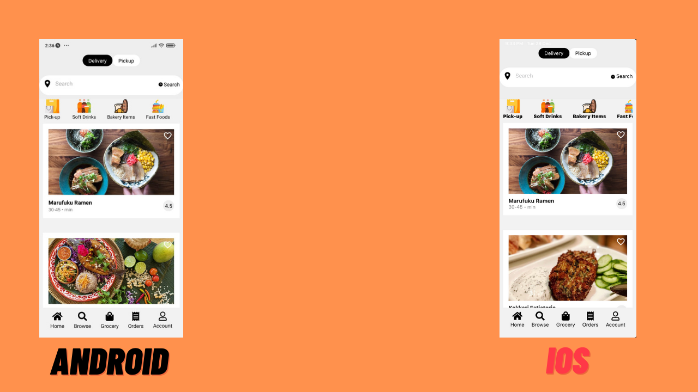
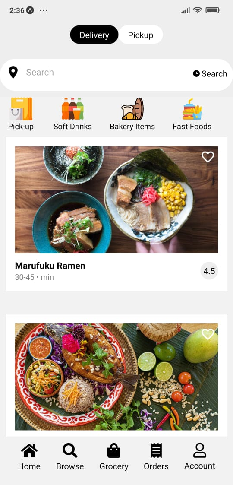
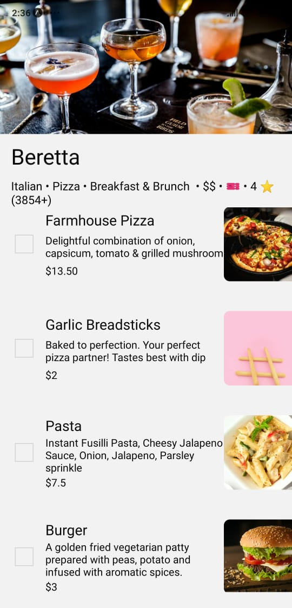
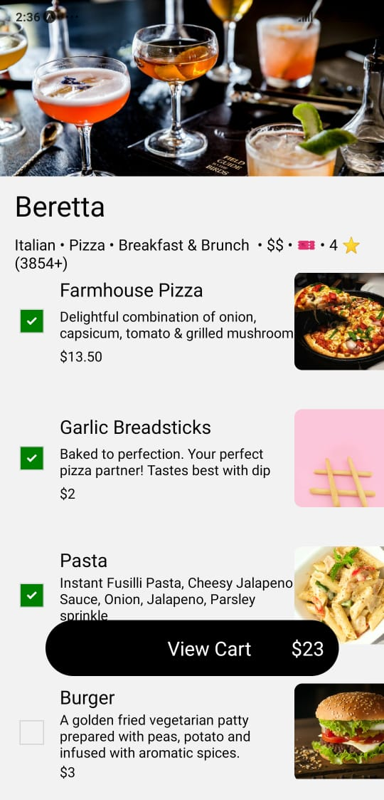
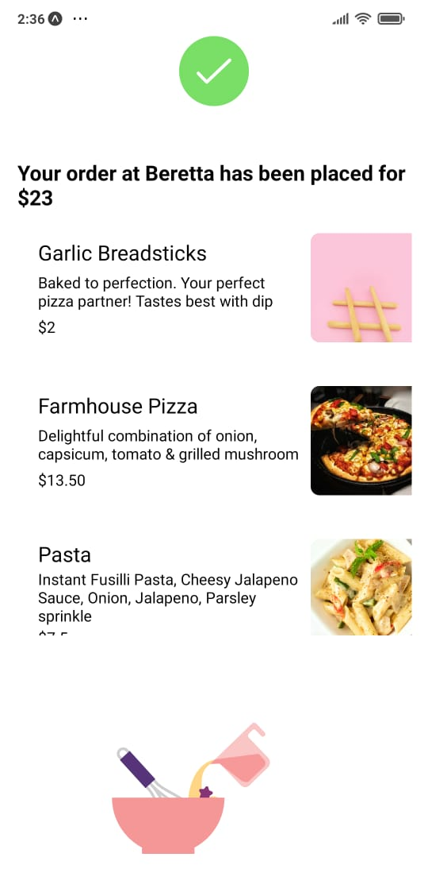

# Food Ordering App

A react native app intented to replicate uber eats.User can browse local restaurants and order food.

[Click here to visit the app on expo](https://expo.dev/@wrecker2200/foodApp )




## Built Using
- [React Native](https://reactnative.dev/)

- [Redux](https://redux.js.org/)

- [Firebase](https://firebase.google.com/)

- [Yelp API](https://fusion.yelp.com/)


## Features
- Full online food ordering app.

- User can browse local restaurants 

- Add to cart Feature.

- Checkout function.

## Screenshots







## Run Locally

- Run ```npm start``` to start the bundler
- Open the project in a React runtime to try it:
  - iOS: [Client iOS](https://apps.apple.com/app/apple-store/id982107779)
  - Android: [Client Android](https://play.google.com/store/apps/details?id=host.exp.exponent&referrer=blankexample)


